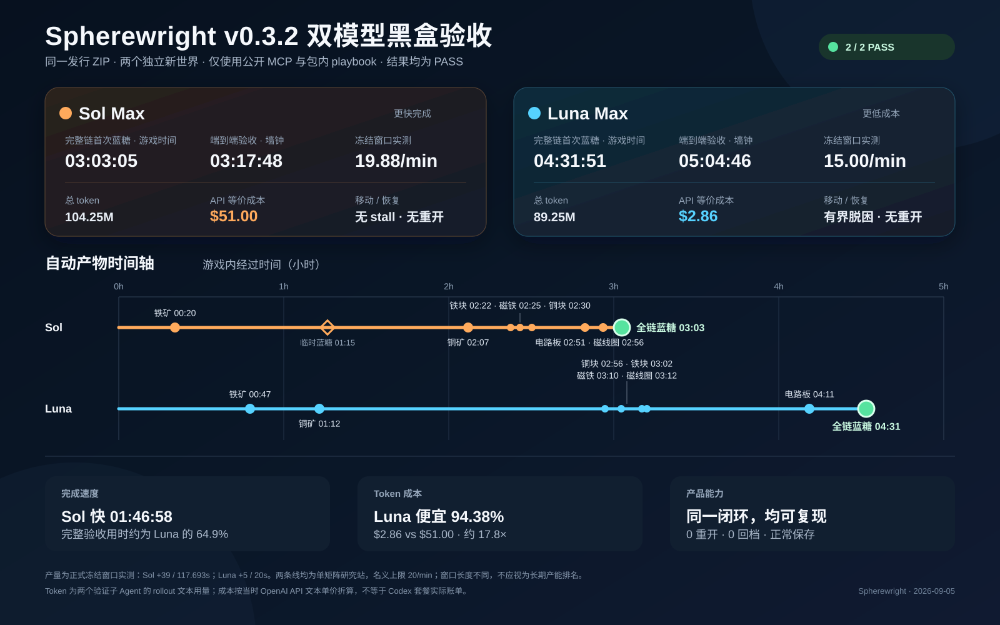
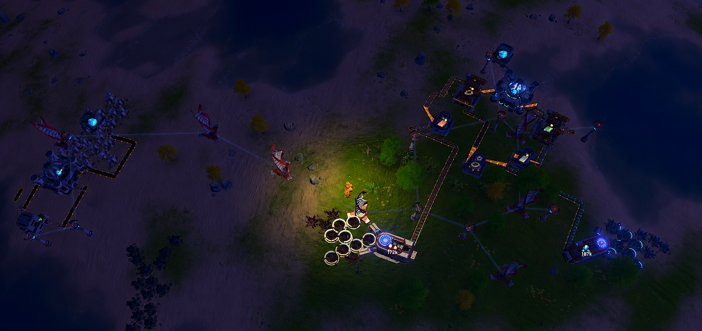
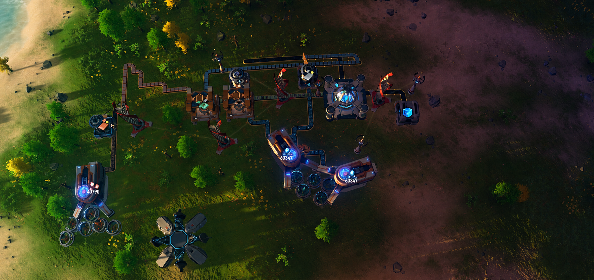

# Spherewright v0.3.2 双模型黑盒验收对比

> GPT-5.6 Sol Max vs GPT-5.6 Luna Max，2026-09-04 至 2026-09-05



[下载博客用 PNG（1600×1000）](./assets/v0.3.2-sol-vs-luna-black-box.png)

## 一句话结论

两个模型都只依赖同一份 Spherewright v0.3.2 发行包，从主菜单创建全新和平、非沙盒、1× 单人世界，最终完成了真实的“铁/铜矿脉 → 冶炼 → 磁线圈/电路板 → 矩阵研究站 → 蓝糖仓储”自动化并正常保存；Sol Max 更快、更接近单研究站的名义产能，Luna Max 则以约 `1/17.8` 的 API 等价成本完成同一验收。

## 受控条件

| 条件 | Sol Max | Luna Max |
|---|---|---|
| 被测包 | v0.3.2 Windows x64 ZIP | 同一 ZIP |
| ZIP SHA-256 | `144add858a16becd17cd8b842108e9c3397d5e9b04700e05db0f967e8e890260` | 相同 |
| 模型 / 推理强度 | GPT-5.6 Sol / Max | GPT-5.6 Luna / Max |
| 世界 | 新建、单人、和平、非沙盒、1× | 相同 |
| 可用知识 | 包内 `INSTALL.md`、MCP 工具描述、开局移动 playbook、实时结构化状态 | 相同 |
| 明确排除 | 仓库源码、测试、experience ledger、旧坐标、Computer Use、键鼠、传送、物品注入、直接状态写入 | 相同 |
| 操作协议 | fresh read → prepare → commit → poll terminal → fresh read | 相同 |
| 是否重开 / 读档 | 否 | 否 |
| 最终结果 | **PASS** | **PASS** |

这里的“黑盒”指测试 Agent 不读取仓库实现或历史经验，只使用普通 MCP Host 能从发行包发现的公开能力。两个 Agent 均创建自己的独立新世界，没有共享地图、布局、坐标或上一轮的运行笔记。

## 两个模式分别怎么完成

### Sol Max：先做可运行原型，再替换为严格全自动链

Sol 先快速解锁五项早期科技，利用手搓磁线圈和电路板建立一条临时供料的矩阵线，在游戏时间 `01:15:30` 首次得到研究站产出的蓝糖，并验证成品导出。它随后明确把这个阶段标记为“中间里程碑”，另建一条没有玩家供料的完整生产链：

```text
铁矿机 ─┬→ 铁块熔炉 ─────────┐
        └→ 磁铁熔炉 → 磁线圈 ├→ 矩阵研究站 → 成品带 → 专用仓
铜矿机 ─→ 铜块熔炉 ─────────┴→ 电路板 ────────┘
```

这是一条“先验证最难设备与物流语义，再扩建并替换输入来源”的路线。代价是经历了一次共享输入带的先后顺序堵塞，还建设并导出过一条临时矩阵线；优势是较早发现了研究站、分拣器、供电和成品导出的几何约束。

### Luna Max：优先打通原料端，再向研究站收口

Luna 没有先给最终链人工灌入中间品。它较早完成铁、铜双矿机，随后逐段建设三座冶炼设备、磁线圈和电路板制造，再铺设较长的输送路径把两种中间品送入研究站，最后接出成品仓。其第一次流水线蓝糖事件就是完整原料链产物，出现在游戏时间 `04:31:51`。

这是更直接的“从资源端逐层收口”路线。它避免了临时供料矩阵线，但在球面移动、能量恢复和密集厂区连接上花费更多时间。

## 产线实景

### Sol Max



Sol 的设备分布范围更大，画面中可见矿机、冶炼与制造设备、跨区传送带、电网以及矩阵研究站。图像由用户在验收后的独立存档中手动取景，并为公开发布裁去含账号信息与 HUD 的边缘区域。

### Luna Max



Luna 的核心加工与矩阵区域相对集中，画面中可见长距离原料带、冶炼与制造设备、电网、矩阵研究站及成品仓。图像由用户在验收后的独立存档中手动取景，并为公开发布裁去含账号信息与 HUD 的边缘区域。

两张截图用于直观展示本次运行实际形成的布局，不替代结构化状态、Journal、冻结窗口和正常保存等验收证据。

## 共同完成的能力

两轮都实际证明了以下闭环，而不只是设备已放置：

- 从主菜单经 `prepare/commit` 创建新世界，首次保存后取得 Spherewright ownership。
- 读取开局移动 playbook；每个已接受动作都轮询到 terminal，再做 fresh read。
- 通过正常手采、手搓、科研、施工无人机、矿机、传送带、分拣器和电网推进游戏。
- 自动开采铁矿和铜矿，并分别生产铁块、磁铁、铜块、磁线圈和电路板。
- 两种中间品自动进入矩阵研究站，蓝糖自动离开研究站并进入专用仓。
- 在冻结玩家输入后，玩家位置、背包和手搓队列不变，蓝糖仓储继续增长，同时矿脉/设备状态继续变化。
- 里程碑后使用 DSP 正常保存流程，fresh read 证明 `ownedSaveState=saved` 且 `writeHealth=healthy`。
- 全程没有重开游戏、重建世界、读取旧档、传送或直接写库存/设备缓冲。

## 科技首次选择时间线

时间均从各自新世界开始计算。“墙钟”来自逐档 Journal 的实际时间，“游戏”来自游戏 tick；差值为 `Luna - Sol`。

| 科技 | Sol 游戏 / 墙钟 | Luna 游戏 / 墙钟 | 游戏时间差 |
|---|---:|---:|---:|
| 电磁学 | `00:17:25` / `00:17:25` | `00:38:03` / `00:38:05` | `+00:20:38` |
| 自动化冶金 | `00:28:29` / `00:28:29` | `00:42:14` / `00:42:16` | `+00:13:46` |
| 基础制造 | `00:27:28` / `00:27:29` | `01:16:54` / `01:16:56` | `+00:49:26` |
| 基础物流系统 | `00:29:30` / `00:29:30` | `01:18:08` / `01:18:10` | `+00:48:38` |
| 电磁矩阵 | `00:26:40` / `00:26:40` | `01:22:31` / `01:22:33` | `+00:55:51` |

两轮选择顺序不同：Sol 先把矩阵、制造、冶金和物流连续解锁；Luna 先拿自动化冶金并启动资源侧建设，再补制造、物流和矩阵科技。

## 第一次手搓产物时间线

这是 Journal 的 `manual_item_first`，表示第一次由机甲复制器实际完成该物品，并不等同于第一次拥有或使用它。科技奖励直接提供的建筑不会伪造成“手搓首次”。

| 产物 | Sol 游戏 / 墙钟 | Luna 游戏 / 墙钟 | 游戏时间差 |
|---|---:|---:|---:|
| 磁铁 | `00:16:26` / `00:16:26` | `00:33:53` / `00:33:54` | `+00:17:27` |
| 铜块 | `00:16:40` / `00:16:40` | `00:35:24` / `00:35:26` | `+00:18:44` |
| 磁线圈 | `00:16:45` / `00:16:45` | `00:36:18` / `00:36:20` | `+00:19:33` |
| 铁块 | `00:22:53` / `00:22:53` | `00:36:47` / `00:36:48` | `+00:13:54` |
| 电路板 | `00:23:53` / `00:23:53` | `00:37:31` / `00:37:32` | `+00:13:38` |
| 齿轮 | `00:25:14` / `00:25:14` | `01:05:24` / `01:05:26` | `+00:40:10` |
| 石材 | `00:33:16` / `00:33:16` | `03:41:06` / `03:41:15` | `+03:07:51` |
| 小型储物仓 | `00:33:21` / `00:33:21` | `03:41:11` / `03:41:20` | `+03:07:51` |
| 风力涡轮机 | `00:36:40` / `00:36:40` | `01:11:13` / `01:11:15` | `+00:34:33` |
| 电力感应塔 | `00:37:13` / `00:37:14` | `01:12:27` / `01:12:29` | `+00:35:14` |
| 采矿机 | `01:41:03` / `01:41:04` | `01:06:55` / `01:06:57` | `-00:34:08` |
| 传送带 | `01:33:59` / `01:34:00` | `02:31:20` / `02:31:24` | `+00:57:21` |
| 分拣器 | `01:38:07` / `01:38:08` | `02:32:58` / `02:33:03` | `+00:54:52` |
| 制造台 Mk.I | `01:42:55` / `01:42:56` | `01:48:56` / `01:48:59` | `+00:06:00` |
| 玻璃 | `01:43:39` / `01:43:39` | — | — |
| 矩阵研究站 | `01:45:14` / `01:45:15` | — | — |

Luna 的玻璃和矩阵研究站没有 `manual_item_first`，表示这次运行没有观察到它们由机甲复制器首次产出；这不表示未使用研究站，最终矩阵设备及其配方、输入、输出都已结构化复读。Sol 较早手搓仓储，是因为它先搭建了临时供料矩阵线；Luna 到最终成品收集阶段才需要手搓仓储。

## 第一次流水线产物时间线

| 产物 | Sol 游戏 / 墙钟 | Luna 游戏 / 墙钟 | 游戏时间差 |
|---|---:|---:|---:|
| 铁矿 | `00:20:28` / `00:20:28` | `00:47:42` / `00:47:43` | `+00:27:14` |
| 铜矿 | `02:07:06` / `02:07:07` | `01:12:55` / `01:12:57` | `-00:54:11` |
| 铁块 | `02:22:39` / `02:22:40` | `03:02:44` / `03:02:49` | `+00:40:05` |
| 磁铁 | `02:25:55` / `02:25:56` | `03:10:18` / `03:10:24` | `+00:44:24` |
| 铜块 | `02:30:08` / `02:30:09` | `02:56:44` / `02:56:50` | `+00:26:37` |
| 磁线圈 | `02:56:01` / `02:56:03` | `03:12:11` / `03:12:16` | `+00:16:09` |
| 电路板 | `02:51:18` / `02:51:20` | `04:11:08` / `04:11:17` | `+01:19:50` |
| 电磁矩阵（Journal 首次） | `01:15:30` / `01:15:30` | `04:31:51` / `04:32:01` | 不宜直接比较 |
| 电磁矩阵（完整原料链首次） | `03:03:05` / `03:03:09` | `04:31:51` / `04:32:01` | `+01:28:46`（游戏） |

Sol 在 `01:15:30` 的蓝糖来自“手搓中间品 → 普通仓储/传送带 → 研究站”，仍然是真实流水线产物，因此 Journal 正确记录了第一次 `production_line_item_first`；但它不满足最终“原矿到蓝糖”的严格验收。Sol 完整链首次蓝糖由专用自动线的研究站读数重建：游戏 tick `659080`，约 `03:03:05`。Luna 从未向最终链手动插入中间品，因此它的第一次蓝糖事件同时就是完整链首次。

## 最终速度与完成时间

### 蓝糖产量

| 指标 | Sol Max | Luna Max |
|---|---:|---:|
| 正式冻结窗口 | `18:53:41.101 → 18:55:38.794` | `00:07:01 → 00:07:21` |
| 窗口长度 | `117.693 s` | `20 s` |
| 专用仓变化 | `67 → 88 → 106` | `144 → 146 → 149` |
| 净增量 | `+39` | `+5` |
| 窗口平均 | **19.882 蓝糖/min** | **15.000 蓝糖/min** |
| 分段速度 | `19.233`、`20.697 /min` | `12.000`、`18.000 /min` |
| 单研究站名义上限 | `20 /min` | `20 /min` |

发行包的运行时配方目录报告电磁矩阵 `timeSpend=180` 游戏 tick、每批产出 1；按标准 60 UPS 即 3 秒/个、20 个/分钟。Sol 的正式长窗口约为名义值的 `99.4%`。Luna 的窗口只有 20 秒，批次相位会显著影响整数计数；其 `15/min` 是该短窗口的实测值，不能据此断言同样的一座研究站具有更低的长期极限。Sol 保存后的补充窗口还出现 `106 → 123`、47.922 秒内 `+17`（21.285/min），同样说明短窗口可能因边界相位暂时高于名义值。

### 完成时间

| 里程碑 | Sol Max | Luna Max | 差异 |
|---|---:|---:|---:|
| 完整原料链首次蓝糖（游戏时间） | **03:03:05** | **04:31:51** | Luna `+01:28:46` |
| 整体黑盒验收墙钟 | **03:17:48** | **05:04:46** | Luna `+01:46:58` |
| 相对耗时 | `1.00×` | `1.54×` | Luna 多约 `54.1%` |

“整体黑盒验收墙钟”包含 MCP 初始化、读文档、建档、规划、失败恢复、最终冻结采样、正常保存和日志收口；它比纯游戏时间更能代表一次外部 Agent 真实完成任务所需的端到端时间。

## Token 与 API 等价成本

| 指标 | Sol Max | Luna Max | Luna 相对 Sol |
|---|---:|---:|---:|
| 非缓存输入 | 1,092,326 | 1,519,836 | `+39.1%` |
| 缓存输入 | 102,886,784 | 87,047,680 | `-15.4%` |
| 输出（含推理） | 273,643 | 683,010 | `+149.6%` |
| 其中推理输出 | 90,826 | 135,798 | `+49.5%` |
| 总 token | **104,252,753** | **89,250,526** | `-14.39%` |
| API 等价成本 | **$50.996878** | **$2.864533** | `-94.38%` |

两轮合计 `193,503,279` token、`$53.861411`。成本按当时 OpenAI Docs 公布的文本价格计算：

- [GPT-5.6 Sol](https://developers.openai.com/api/docs/models/gpt-5.6-sol)：输入 `$4.00/M`、缓存输入 `$0.40/M`、输出 `$20.00/M`。
- [GPT-5.6 Luna](https://developers.openai.com/api/docs/models/gpt-5.6-luna)：输入 `$0.20/M`、缓存输入 `$0.02/M`、输出 `$1.20/M`。

两轮均没有单请求超过 272K 输入，因此没有触发长上下文加价；cache write 为 0；推理 token 已包含在输出 token 中，没有重复计费。这里统计的是两个验证子 Agent 的 rollout 文本 token，不含主会话，也不等于 Codex 套餐的实际账单。Luna 虽然输出量约为 Sol 的 2.50 倍、完成时间更长，但单次成功验收的 API 等价成本仍约为 Sol 的 `1/17.8`。

## 阻断与恢复对比

| 观察项 | Sol Max | Luna Max |
|---|---|---|
| 需要重开游戏 / 新档 / 回档 | 否 | 否 |
| `route_stalled` | 0 | 0 |
| `position_stalled` | 未观察到 | 有；均改用新的有界短目标恢复 |
| 相同失败移动目标重放 | 否 | 否 |
| 超过约 5 分钟的单次异常阻断 | 否 | 否 |
| 能量问题 | 大批手搓时耗尽核心能量，在已验证电塔覆盖内正常充电 | 出现燃料耗尽的动作终态，正常补能后继续 |
| 主要施工摩擦 | `TooFar`、`Collide`、`NeedGround`、`PowerTooClose`、`WindTooClose`；共享输入带发生先后顺序堵塞 | `STALE_STATE`、`BUILD_CONNECTION_INVALID`、`INVALID_REQUEST`、`ACTION_REJECTED`；球面移动与长距离接线更慢 |
| 是否形成能力级 blocker | 否 | 否 |

Sol 还暴露了三个发行接口易用性问题：幂等键 schema 没有声明 UUID 格式；未知坐标字段会被静默忽略；遗漏资源 `kind` 时错误较泛化。它们都被计划回读或 schema 复读及时拦住，没有造成错误 commit。Luna 的位置卡住则直接验证了 v0.3.2 开局移动 playbook：终止失败 Move、禁止相同目标重试、采用新的局部短目标、成功后 fresh read。

## 如何解读这次对比

1. **能力结论相同。** 两个价位差异很大的模型都能仅凭发行包公开能力完成新档到蓝糖全自动，说明 v0.3.2 的 MCP 工具、结构化错误和 playbook 已足以支撑普通 Host。
2. **Sol 的优势是时间和稳态效率。** 它更快形成技术/物流心智模型，虽然走过临时矩阵线，仍比 Luna 早约 1 小时 29 分钟得到完整链蓝糖，最终长窗口基本跑满单研究站名义产能。
3. **Luna 的优势是成本。** 它需要更多输出 token、更多移动/几何尝试和更长墙钟时间，但总 token 仍少 14.39%，API 等价成本低 94.38%。
4. **不能把 19.882 与 15.000 简化成模型控制下的固定产能差。** 两条线最终都是一座同配方研究站，采样窗口却分别为 117.693 秒和 20 秒；长期产能应使用更长、同长度窗口再次比较。
5. **单次样本不能代表模型总体排名。** 两轮使用不同随机世界、资源分布和 Agent 决策轨迹；它们证明“可完成”和呈现本次代价，不构成统计显著的基准测试。

## 证据边界

- 两个 Journal 都是 `from_new_game`、历史覆盖完整，首次事件从各自游戏 tick 1 开始；最终序列均已 durable，无 pending persistence。
- Sol 完整原料链首次蓝糖由结构化研究站读数补充，因为该档 Journal 更早记录过一次人工中间品供料的流水线蓝糖。
- 产量窗口同时核对玩家状态、空手搓队列、矿机/矿脉、上下游缓冲、供电和成品仓，不以单个 Journal 事件作为唯一证据。
- Sol 脱敏运行日志：35,271 bytes，SHA-256 `f7d613bc25a5561ded0aa8461e8ecbd45b503e8fb05139fb25a00197d795edff`。
- Luna 脱敏运行日志：4,217 bytes，SHA-256 `a7c61c93795b6d5e23d085023ce69726ec52483a009a7deb083d4230f368acc8`。
